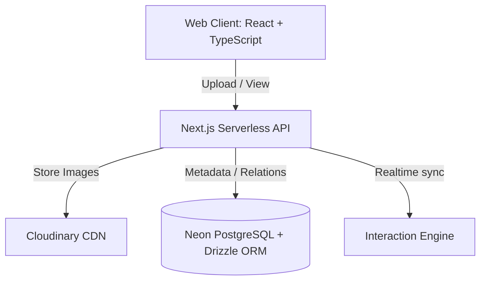

# 📖 EventFold Studio

<div align="center">


[](https://eventfoldstudio.com)
[](https://www.typescriptlang.org/)
[](https://react.dev/)
[](https://neon.tech/)

**Turning static photo links into interactive 3D digital flipbooks.**  
*Built for modern wedding & event photographers in India.*

</div>

---

## 🚀 The Problem & The Solution

Wedding and event photographers in India traditionally share static drive links, zip files, or flat online galleries. Clients swipe through hundreds of images passively, losing the premium, cinematic feel of physical albums.

**EventFold Studio** bridges this gap by automatically converting photo galleries into highly interactive, beautifully animated **3D digital flipbooks**. 

---

## ✨ Features

- **📖 3D Album Engine:** Realistic 3D page-flipping physics with shadow cast, sound effects, and smooth rendering.
- **☁️ Cloudinary Media pipeline:** Auto-compresses and optimizes large RAW photos for instant load times even on slow mobile networks.
- **🎨 Photographer Custom Branding:** Add your studio name, logo, custom background themes, and contact details to every shared flipbook link.
- **⚡ Real-time Analytics:** Track client interaction—know when they open the flipbook, which page they spend the most time on, and what photos they favorite.
- **📱 Mobile Optimized:** Designed first for mobile screens so families can flip through albums comfortably on WhatsApp.

---

## 🛠️ Architecture & Tech Stack



- **Frontend:** React, Tailwind CSS, Framer Motion (for animations), HTML5 Canvas 3D Flipping Engine.
- **Backend:** Next.js Serverless Functions, TypeScript.
- **Database & ORM:** Neon Database (Serverless PostgreSQL), Drizzle ORM.
- **Asset Storage:** Cloudinary SDK for optimized image uploads and transform-on-the-fly assets.

---

## 📦 Local Installation

To run EventFold Studio locally:

1. **Clone the repository:**
   ```bash
   git clone https://github.com/DilpreetSinghVerma/EventFold.git
   cd EventFold
   ```

2. **Install dependencies:**
   ```bash
   npm install
   ```

3. **Set up environment variables:**  
   Create a `.env.local` file in the root directory:
   ```env
   DATABASE_URL=postgresql://...
   NEXT_PUBLIC_CLOUDINARY_CLOUD_NAME=your_cloud_name
   CLOUDINARY_API_KEY=your_api_key
   CLOUDINARY_API_SECRET=your_api_secret
   ```

4. **Run database migrations:**
   ```bash
   npx drizzle-kit push
   ```

5. **Start the development server:**
   ```bash
   npm run dev
   ```

---

## 🤝 Connect

- Website: [eventfoldstudio.com](https://eventfoldstudio.com)
- Email: [dilpreetsinghverma@gmail.com](mailto:dilpreetsinghverma@gmail.com)
- LinkedIn: [Dilpreet Singh](https://linkedin.com/in/dilpreet-singh-709b35310)
